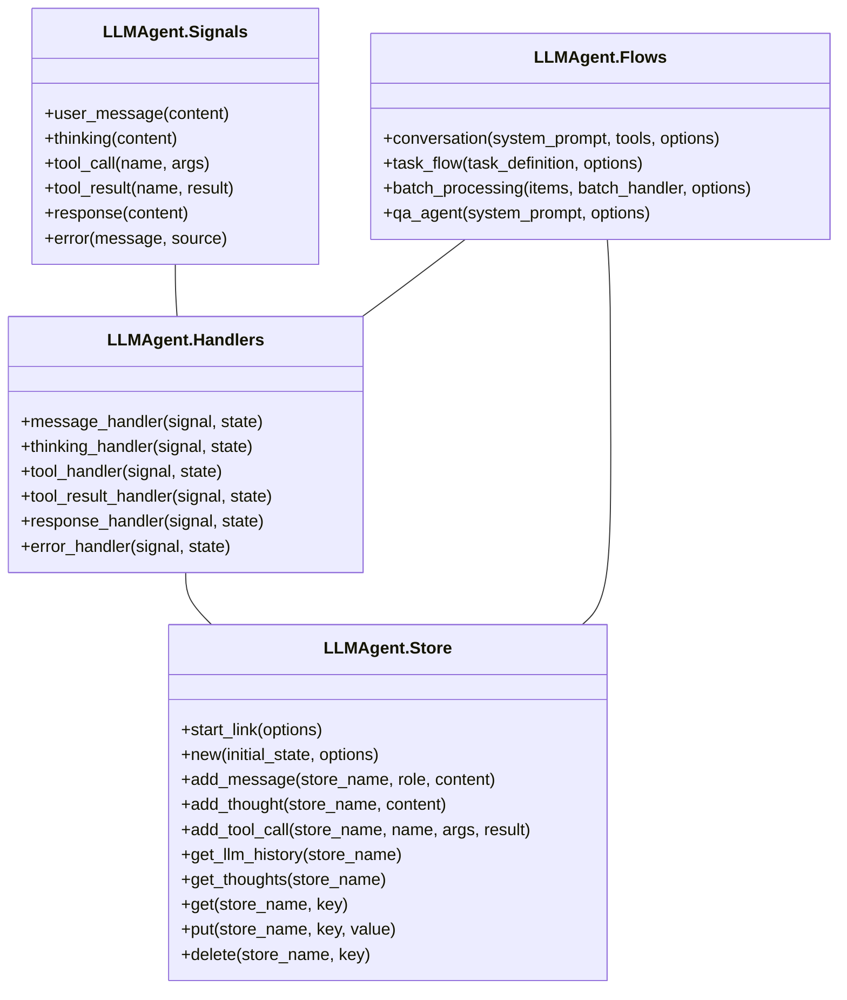
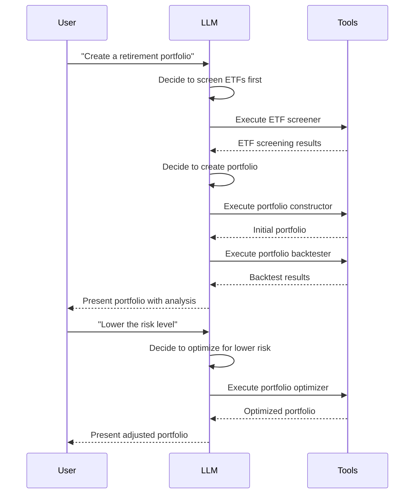

# LLMAgent Architecture

This guide provides an overview of the LLMAgent architecture, explaining how it builds on AgentForge's signal-driven design while providing LLM-specific abstractions.

## Core Principles

LLMAgent is designed with the following principles in mind:

1. **LLM-Specific Abstractions**: Create patterns optimized for LLM interactions
2. **Separation of Concerns**: Clearly delineate LLM logic from infrastructure
3. **Elixir Ecosystem Integration**: Leverage the strengths of Elixir/OTP
4. **Lightweight Implementation**: Maintain a clean, minimal codebase
5. **Testability**: Ensure components can be tested in isolation

## System Architecture

LLMAgent extends AgentForge's signal-driven architecture with components specifically designed for LLM interactions:

### Core Components

1. **Signals**: Represent events in the agent lifecycle
2. **Handlers**: Process signals and update state
3. **Store**: Manages conversation state and history using GenServer processes, providing a centralized state management system that leverages Elixir's OTP capabilities
4. **Flows**: Combine handlers into coherent sequences
5. **Providers**: Interface with LLM backends
6. **Tools**: External capabilities the agent can use

## Signal Flow

The typical flow of a conversation follows these steps:

1. User input is converted to a `:user_message` signal
2. The message handler processes the user message and generates a `:thinking` signal
3. The thinking handler calls the LLM and decides whether to use a tool or generate a response
4. If using a tool, it generates a `:tool_call` signal
5. The tool handler executes the tool and generates a `:tool_result` signal
6. The tool result handler incorporates the result and generates a new `:thinking` signal
7. Eventually, the LLM generates a response, creating a `:response` signal
8. The response handler formats and returns the final response

## Component Diagram

Here is a detailed component diagram showing the relationships between the main modules:

## Dynamic Workflow Orchestration

One of LLMAgent's key strengths is its ability to support truly dynamic workflows that emerge from LLM decisions, rather than being hardcoded in advance:

### Workflow Emergence

In a traditional application, the sequence of operations is predetermined by the developer. With LLMAgent, the workflow emerges dynamically:

1. **Context-Based Decisions**: The LLM analyzes user inputs and current state to decide the next steps
2. **Tool Selection**: Tools are chosen dynamically based on the specific needs of the current task
3. **Multi-Step Processing**: Complex tasks are broken down into sequences of operations
4. **Adaptive Responses**: The system adjusts based on intermediate results and user feedback

### Example: Investment Portfolio Creation

The investment portfolio example demonstrates this dynamic capability:

This workflow was not predefined - it emerged from the LLM's analysis of user requests and available tools. The same architecture can support completely different workflows in other domains without changing the underlying code.

## Extension Points

LLMAgent is designed to be extended in several ways:

1. **Custom Handlers**: Create specialized handlers for domain-specific signals
2. **Custom Flows**: Combine handlers in new ways for different interaction patterns
3. **Custom Tools**: Add new capabilities to your agent
4. **Provider Plugins**: Integrate with different LLM backends

## Design Decisions

### Why Signal-Driven Architecture?

The signal-driven architecture provides several benefits:

1. **Composability**: Handlers can be combined in flexible ways
2. **Testability**: Each component can be tested in isolation
3. **Extensibility**: New signals and handlers can be added without changing existing code
4. **Visibility**: The flow of information is explicit and traceable

### Why Elixir?

Elixir's functional nature, pattern matching, and supervision trees make it ideal for building reliable, maintainable agent systems:

1. **Immutable State**: Ensures predictable state transitions
2. **Pattern Matching**: Makes signal handling elegant and explicit
3. **Concurrency**: Allows handling multiple conversations efficiently
4. **Fault Tolerance**: Supervisors can restart failed components

## Next Steps

- Explore [tool integration](tool_integration.html)
- Learn how to create [custom agents](custom_agents.html)
- Understand [LLM provider integration](provider_guide.html)
