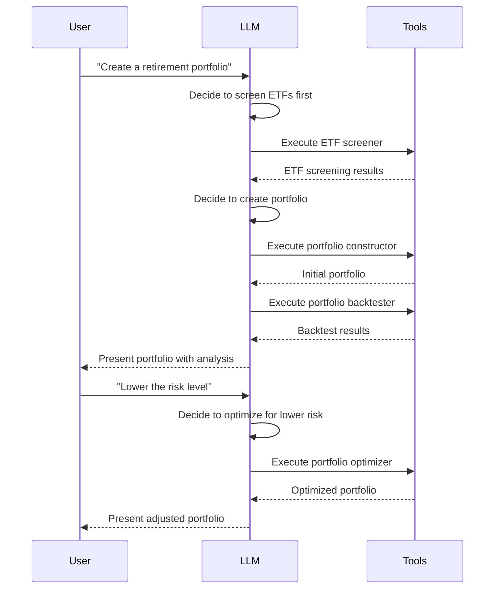
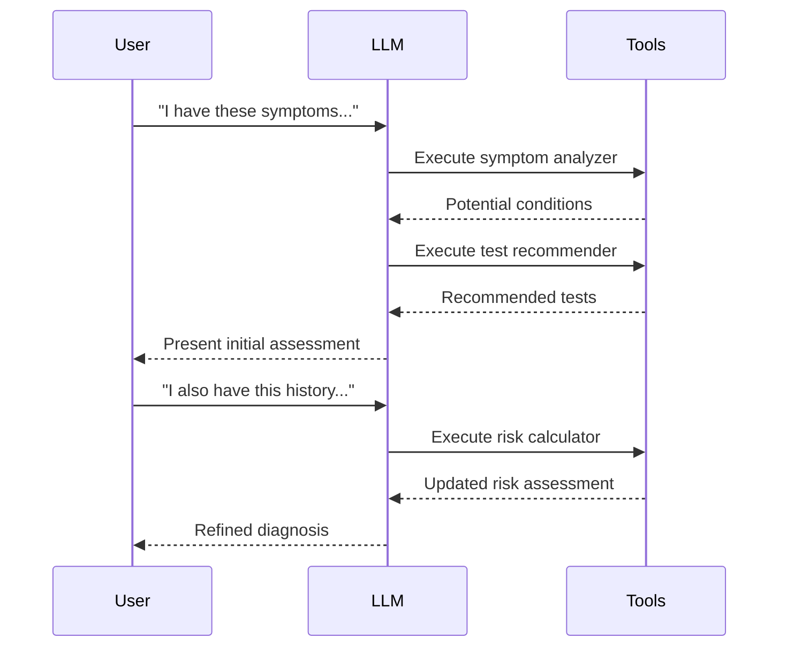
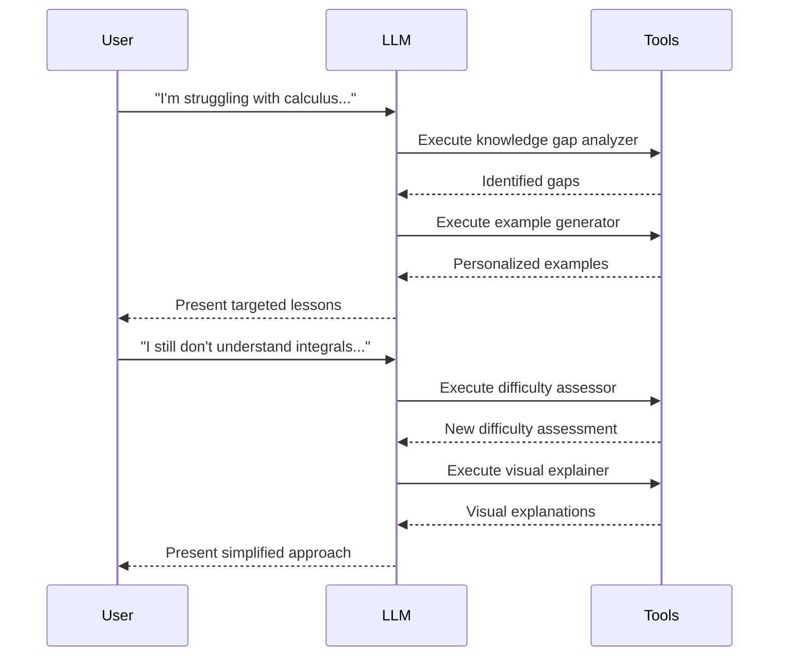

# Dynamic Workflow Orchestration

This guide explores one of LLMAgent's most powerful capabilities: dynamic workflow orchestration - enabling LLMs to adaptively create and modify multi-step workflows based on context and user input.

## Key Concepts

### What is Dynamic Workflow Orchestration?

Traditional software follows predetermined paths coded by developers. In contrast, LLMAgent enables:

- **Emergent Workflows**: Sequences of operations that aren't hardcoded but emerge from LLM decisions
- **Context-Driven Paths**: Next steps determined by analyzing current state and user inputs
- **Adaptive Processing**: Workflows that adjust based on intermediate results
- **Tool Composition**: Dynamic selection and sequencing of available tools

### The Orchestration Process

The dynamic workflow process follows this general pattern:

1. **Analysis**: The LLM analyzes user input in context of the current state
2. **Decision**: The LLM decides which action to take (use a tool or respond directly)
3. **Execution**: If using a tool, the system executes it and captures results
4. **Integration**: Results are incorporated into the state for next decisions
5. **Adaptation**: Based on results and user feedback, the workflow adapts

## Implementation Patterns

### State-Based Decision Making

The core of dynamic orchestration is maintaining rich state that informs decisions:

```elixir
# LLM analyzes message and state to decide next action
def process_message(state, message) do
  # Analyze message in context of existing state
  decision = call_llm_for_decision(message, state)
  
  case decision do
    {:use_tool, tool_name, params} ->
      # Execute tool and update state with results
      result = execute_tool(tool_name, params)
      update_state(state, result)
      
    {:respond, content} ->
      # Direct response without tool use
      generate_response(state, content)
  end
end
```

### Tool Selection Logic

The LLM must be given enough context to make informed tool selections:

```elixir
def simulate_tool_selection(message, state) do
  # In a real implementation, this would call the LLM
  # to analyze the message and state
  cond do
    contains_question_about?(message, state.knowledge) ->
      {:use_tool, "knowledge_base", %{query: extract_query(message)}}
      
    requests_calculation?(message) ->
      {:use_tool, "calculator", %{expression: extract_expression(message)}}
      
    true ->
      {:respond, "I'll help you with that..."}
  end
end
```

## Example: Investment Portfolio Assistant

The investment portfolio example demonstrates dynamic workflow orchestration in action:

### Workflow Visualization



### Implementation Example

Below is a simplified implementation of this dynamic workflow:

```elixir
defmodule InvestmentDemo do
  # Start a new conversation store
  def start_conversation do
    store_name = __MODULE__.Store
    LLMAgent.Store.start_link(name: store_name)
    store_name
  end

  # Process a user message using store
  def process_message(store_name, message) do
    # Simulate LLM analyzing message and deciding which tool to use
    {tool_name, tool_args, thinking} = simulate_llm_tool_selection(message, store_name)
    
    # Show the simulated thinking process
    IO.puts("Assistant thinking: #{thinking}")
    
    # Execute the selected tool if applicable
    if tool_name do
      # Execute the tool
      tool_result = execute_tool(tool_name, tool_args, store_name)
      
      # Update store with tool results
      update_store_with_tool_result(store_name, tool_name, tool_result)
      
      # Process the result (may trigger another tool or generate response)
      process_tool_result(store_name, tool_name, tool_result)
    else
      # No tool selected, generate direct response
      generate_final_response(store_name, message)
      :ok
    end
  end
  
  # Simulate LLM's decision-making for tool selection
  defp simulate_llm_tool_selection(message, state) do
    cond do
      # Initial portfolio request - decide to screen ETFs first
      String.contains?(String.downcase(message), "portfolio") and state.portfolio == nil ->
        {
          "etf_screener", 
          %{},
          "The user is asking for a retirement ETF portfolio. I should first get a list of available ETFs."
        }
      
      # Risk adjustment request - use portfolio optimizer  
      String.contains?(String.downcase(message), "risk") and 
      String.contains?(String.downcase(message), "lower") and
      state.portfolio != nil ->
        {
          "portfolio_optimizer",
          %{
            "portfolio" => state.portfolio,
            "preferences" => %{"risk_tolerance" => "Lower"}
          },
          "The user wants to reduce risk. I'll use the portfolio_optimizer to adjust for lower risk."
        }
        
      # Other conditions for different tool selections...
      
      # Default - no tool needed
      true ->
        {
          nil,
          nil,
          "I'll respond directly to this request without using tools."
        }
    end
  end
  
  # Other helper functions for tool execution, state management, etc.
end
```

## Applications Across Domains

Dynamic workflow orchestration can be applied in many domains:

### Medical Diagnosis



### Educational Tutoring



## Benefits and Best Practices

### Benefits

- **Flexibility**: Adapt to unexpected user requests
- **Modularity**: Add new tools without rewriting workflows
- **User-Centered**: Follow user's thought process rather than rigid paths
- **Progressive Refinement**: Improve solutions based on feedback

### Best Practices

1. **Rich State Management**: Ensure state captures important context
2. **Clear Tool Documentation**: Give LLM clear understanding of available tools
3. **Thoughtful System Prompts**: Design prompts that encourage multi-step thinking
4. **Intermediate Confirmations**: For critical workflows, confirm steps with users

## Conclusion

Dynamic workflow orchestration represents a paradigm shift in software design. Rather than predefined process flows, LLMAgent enables truly adaptive, emergent processes driven by LLM intelligence and contextual understanding.

By implementing these patterns, developers can create experiences that feel more like working with a thoughtful human collaborator than interacting with rigid software systems.
